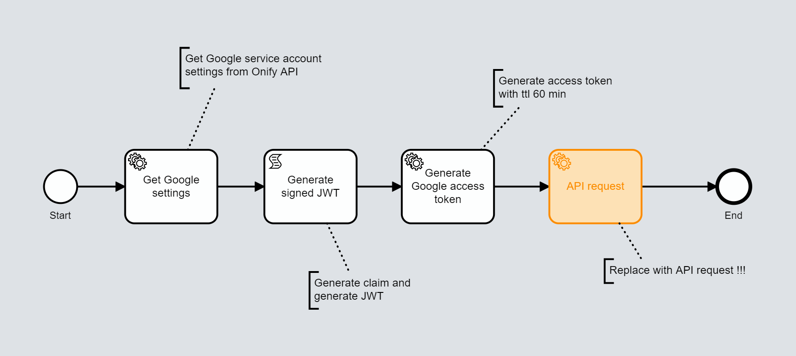

# Onify Blueprint: Authenticate against Google API with service account

This Blueprint shows how to authenticate with Google API using a service account. From there you can then access

## Requirements

* Onify Hub v2
* Onify Flow license
* Camunda Modeler 4.4 or later 
* Google G Suite

## Included

* Settings
* Workflow (Flow)

## Setup

### Google

In order to index information from Google we need to setup a couple of things.

1. Create a new Google cloud project (optional)
2. Create a service account
3. Create a private key (json) for the service account
4. Activate Admin SDK service for the project
5. Enable G Suite domain-wide delegation
6. Delegate domain-wide authority to your service account

### Settings

Add the following settings via `/admin/settings`.

|Key|Name|Description|Value|Type|Tag|Role|
|---|----|-----------|-----|----|---|----|
|google_customerid|Google customer id|Customer id where the users are located|xxxxxxx|string|google|admin|
|google_serviceaccount_email|Google service account email|Service account email|*.iam.gserviceaccount.com|string|google|admin|
|google_serviceaccount_impersonate_email|Google service account impersonate email|What user to impersonate. Must be valid user in G Suite|*@onify.co|string|google|admin|
|google_serviceaccount_privatekey|Google service account private key|The private key for the service account|----BEGIN PRIVATE KEY-----***|string|google|admin|

### Flows

#### Configure

* Modify the `scope` for the authentication request
* Add your own API request in the end

#### Deploy

1. Open `blueprint-google-api-auth.bpmn` in Camunda Modeler
2. Customize the flow (optional)
3. Click `Deploy current diagram` and follow the steps

#### Run 

To test and run the flow, click `Start current diagram`

## Support

* Community/forum: https://support.onify.co/discuss
* Documentation: https://support.onify.co/docs
* Support and SLA: https://support.onify.co/docs/get-support

## License

This project is licensed under the MIT License - see the [LICENSE](LICENSE) file for details.